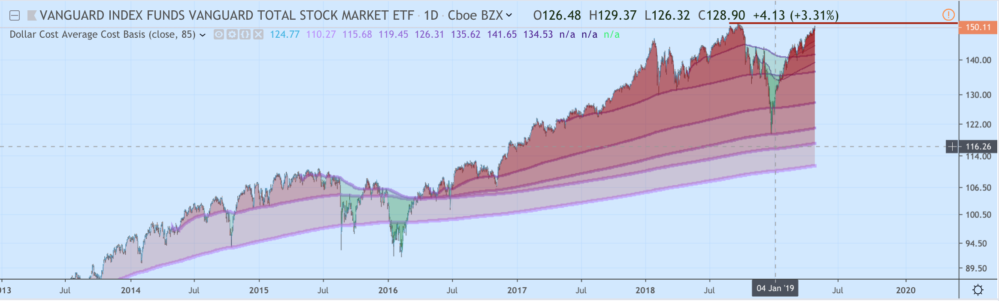
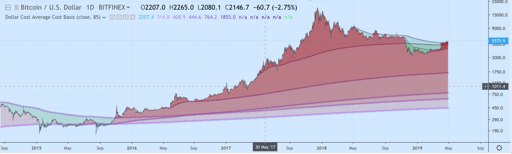
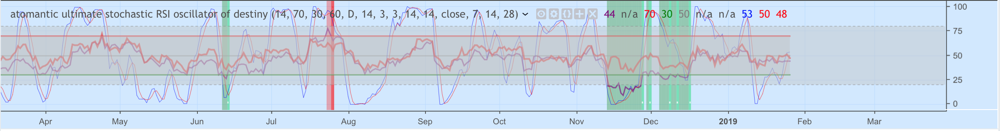

# TradingView Custom Pine Scripts

## DCACB - Dollar Cost Average Cost Basis

> Shows the cumulative cost-basis for buying a fix $ qauntity of the asset over various plots: `30 days`, `60`, `90`, `120`, `180`, and `1-6 years` 
>    - when the current price is profitable for the DCA plot, fills red
>    - when it will reduce the cost-basis for a DCA investor to buy more, turns green
>    - draws heavier support lines for longer term DCA investors
>    - intensifies colors to show where larger pools of players stand with DCA profitability

Note: since pinescript doesn't have arrays/collections and you can't plot within a for loop anyway, this repo contains `gen.dcacb.sh`, which generates the repetitive pinescript using `bash`.

## AUSROD - atomantic ultimate stochastic RSI of Destiny

> A combined indicator, overlapping the following three indicators
>    - RSI (with option to add second timeframe)
>    - Stochastic RSI
>    - Ultimate Oscillator

# Making Money From My Work?
⚡ Lightning Network Satoshi Tips Accepted https://tippin.me/@antic
> With the advent of Bitcoin Lightning Network, you can tip me as little as 1 satoshi (.00000001 $BTC). 1000 satoshi is about $.04 as of this writing. Any amount is appreciated :)

Don't have Lightning? 
- [Blue Wallet (for iOS and Android)](https://bluewallet.io/)
- [Eclair Wallet (for Android)](https://play.google.com/store/apps/details?id=fr.acinq.eclair.wallet.mainnet2)

# Contributing
I welcome pull-requests. Feel free to submit Issues on this project or submit your own modifications or scripts