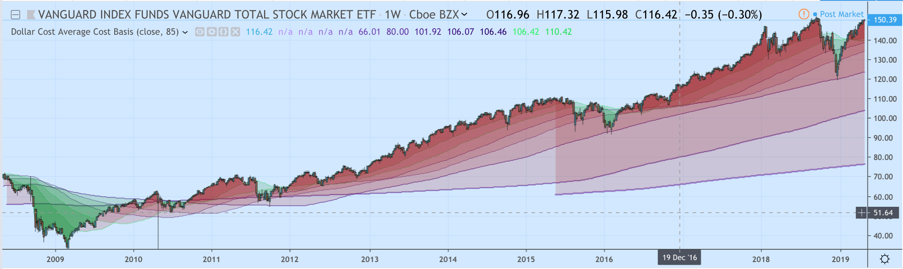
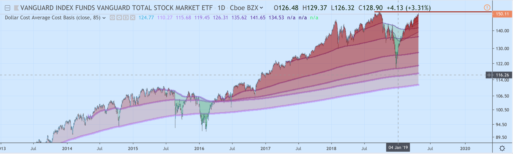
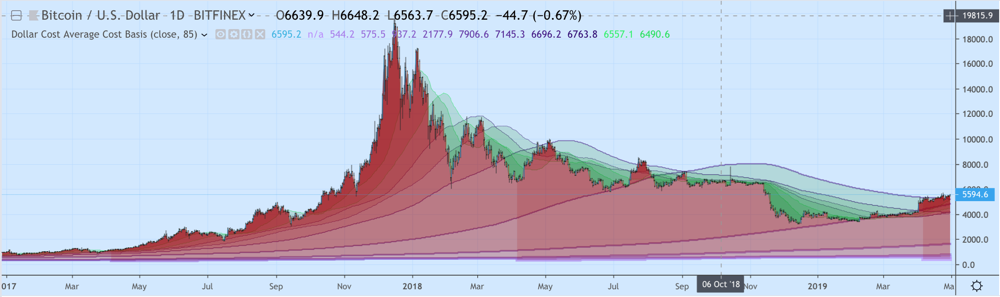
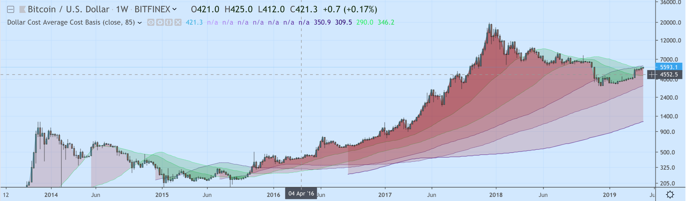

# TradingView Custom Pine Scripts

## DCACB - Dollar Cost Average Cost Basis
> Shows the cumulative cost-basis for buying a fixed $ quantity of the asset over various plots: `30 days`, `60`, `90`, `120`, `180`, and `1-6 years` 
>    - when the current price is profitable for the DCA plot, fills red
>    - when it will reduce the cost-basis for a DCA investor to buy more, turns green
>    - draws heavier support lines for longer term DCA investors
>    - intensifies colors to show where larger pools of players stand with DCA profitability
>    - has a rolling window option (default is false/static)

Note: since pinescript doesn't have arrays/collections and you can't plot within a for loop anyway, this repo contains `gen.dcacb.sh`, which generates the repetitive pinescript using `bash`.

## AUSROD - atomantic ultimate stochastic RSI of Destiny
> A combined indicator, overlapping the following three indicators
>    - RSI (with option to add second timeframe)
>    - Stochastic RSI
>    - Ultimate Oscillator

# Making Money From My Work?
⚡ Lightning Network Satoshi Tips Accepted antic@stacker.news

# Contributing
I welcome pull-requests. Feel free to submit Issues on this project or submit your own modifications or scripts
